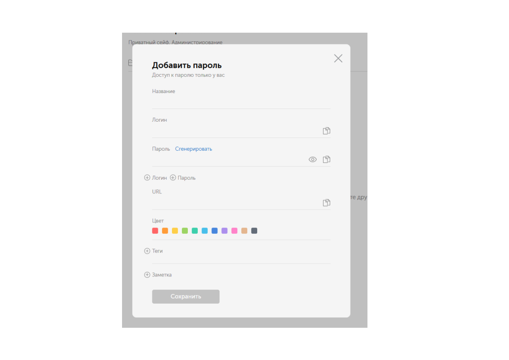

# passwords-in-Passwork

Работа с паролями в программе Passwork.

Добрый день. Сегодня мы рассмотрим, как работать с паролями в интерфейсе программы PASSWORK.
Прежде всего выберите нужный вам сейф, в который вы хотите поместить новый пароль: 
 

 
Вы можете разместить пароль в сейфе как в корне, так и в созданной в нём папке.
 
Для создания пароля можно использовать две функции:

Откроется меня создания пароля:

 
В развернувшемся окне вы можете ввести Название вашего пароля, для удобства его поиска, логин, непосредственном сам пароль.
Используя дополнительные вкладки, вы можете дополнить ваши данные ещё одной связкой логин/пароль, либо изменить название графы, на необходимое вам:

  
Так же можно добавить ссылку на сайт, где используется этот пароль, выбрать для него цвет (работа с группировкой паролей) или задать тег для его поиска.
 
Когда пароль был создан он отобразиться в том месте, где вы использование функцию сохранения пароля:

 
Если вы нажмете на пароль, всплывёт вспомогательное окно для работы с этим паролем:

 
При нажатии на элемент «Изменить» появится такое же окно как при создании пароля, и вы сможете его отредактировать.
 
Элемент «Настроить» позволит вам производить простейшие действия с вашим паролем:

 
При нажатии на «Поделиться» появится окно с выбором каким образом вы хотите разрешить другим пользователям доступ к этому паролю: 

 
Вы можете либо отправить ему e-mail с приглашением к доступу к этому паролю:

 
Либо можете создать гиперссылку с заданными критериями:

